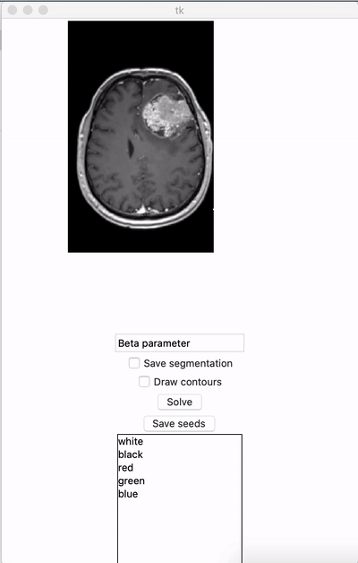
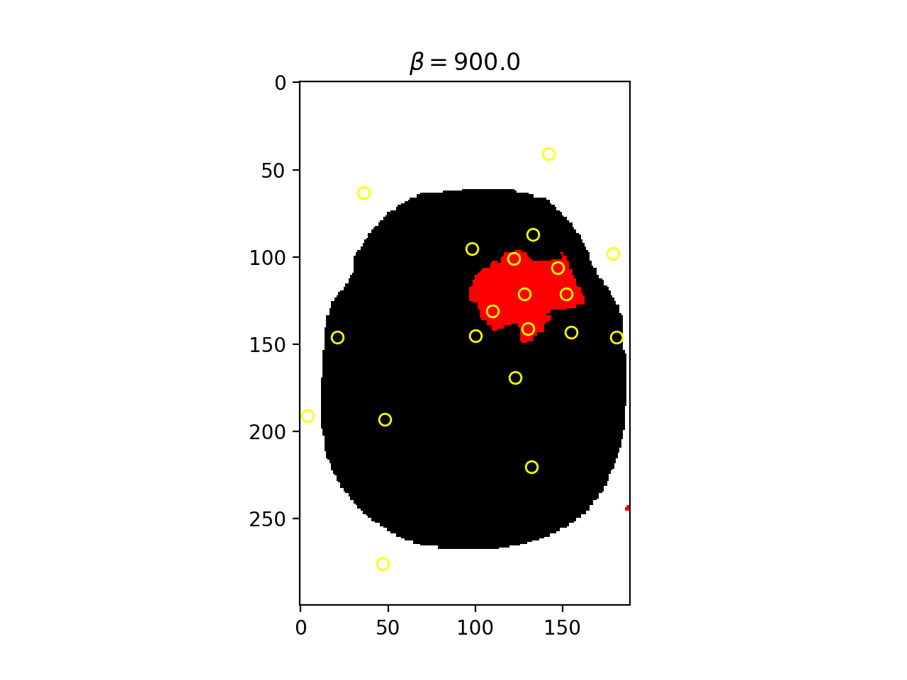
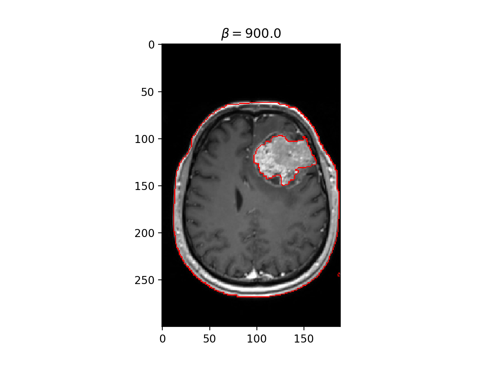

# Random Walker Algorithm project

## Originial paper 

[Leo Grady, Random Walks for Image Segmentation, 2006](http://vision.cse.psu.edu/people/chenpingY/paper/grady2006random.pdf)

## Requirements
* Python 3.7
* Modules :
```bash
pip install -r requirements.txt
```

## Getting started

```bash
python random_walker.py
```

* Select an image.
* Select a color and add seed points by pointing and clicking.
* Type a value for beta
* Run the solver. 

## Demo
### Input 

### Add seeds and choose beta

### Output

